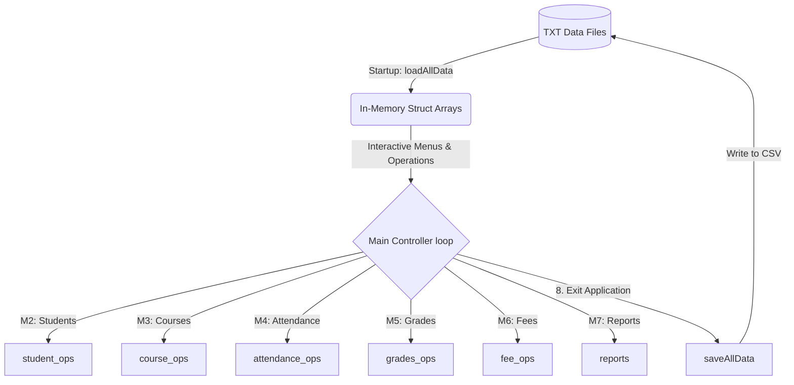

# Campus Analytics Engine

A multi-file, menu-driven data analytics and academic management system designed for university campuses. The system is built using **C++ fundamentals** under strict academic constraints: it relies entirely on structured arrays, custom search and sorting algorithms, manual date parsing, and raw text-file data storage.

---

## 🏛️ How the System Works

The Campus Analytics Engine operates as a lightweight database engine in memory, loading structured text files on startup, providing interactive management menus, and writing all changes back to the text files upon a graceful exit.



### 1. In-Memory Data Storage (Structs & Arrays)
Data is managed using C++ `struct` arrays with fixed-size capacities:
*   `Student` array: Holds up to 100 student records (names, rolls, GPA, semesters, active statuses).
*   `Course` array: Holds up to 50 course offerings (codes, credits, instructors, capacities, enrolled counts).
*   `AttendanceRecord` array: Holds up to 5,000 records of daily student attendance logs.
*   `GradeRecord` array: Holds up to 1,000 academic records of student marks, grades, and quiz details.
*   `FeeRecord` array: Holds up to 500 fee ledger items (totals, paid amounts, due dates, statuses).

### 2. Core File I/O & CSV Parser (`filehandler.cpp`)
All data persistence is driven by a custom-written comma-separated value (CSV) reader and writer:
*   `readTXT`: Opens files, skips the header row, and reads lines. It utilizes a character-by-character parsing loop to correctly handle fields enclosed in double quotes (e.g., names with commas).
*   `writeTXT`: Overwrites files with raw 2D string vectors (`vector<vector<string>>`) and formats them cleanly with commas, wrapping text containing commas in double quotes.
*   `appendTXT`: Appends single records to existing log files.

### 3. Graceful Crash Protection & Input Safety
Interactive command-line applications are highly susceptible to stream corruption. If a user enters non-numeric text into a numeric prompt or inputs `Ctrl+Z` (EOF) on Windows, a standard `cin >>` stream fails, leading to infinite loops or instant crashes. 

To mitigate this, a robust input-safety layer is implemented in `filehandler.cpp` and utilized across the entire project:
*   `safeReadInt(int fallback)`: Reads integers. If the stream fails due to invalid characters or EOF, it clears the stream error state (`cin.clear()`), discards the remaining buffer (`cin.ignore()`), and returns the fallback value.
*   `safeReadDouble(double fallback)`: Performs the same safety checks for decimal values.
*   `safeReadLine()`: Reads a full line of text, handling end-of-file indicators safely.
*   **EOF Verification**: All sub-menus and operation loops check `cin.eof()` after every input prompt, immediately returning to the main menu if `Ctrl+Z` is detected.

---

## 📁 File Structure

```
Campus_Analytics_Engine/
│
├── README.md               # Documentation and execution guide
├── main.cpp                # Core menu controller and program entry point
│
├── filehandler.h/.cpp      # M1: CSV I/O, character-based parser, and input safety
├── student_ops.h/.cpp      # M2: Student management (Selection sort by roll number)
├── course_ops.h/.cpp       # M3: Course registration, capacity controls, prerequisites
├── attendance_ops.h/.cpp   # M4: Daily attendance logging, shortage lists, undo utility
├── grades_ops.h/.cpp       # M5: Marks entry, credit-weighted GPA, best 3-of-5 quizzes
├── fee_ops.h/.cpp          # M6: Ledger tracking, late fines (2% per week), defaulter lists
├── reports.h/.cpp          # M7: Merit lists, semester result sheets, department stats
│
├── students.txt            # Database table: Student profiles
├── courses.txt             # Database table: Course catalog
├── enrollments.txt         # Database table: Course registration ledger
├── attendance_log.txt      # Database table: Daily attendance records (5 columns)
├── fees.txt                # Database table: Financial accounts ledger
└── grades.txt              # Database table: Student grades ledger
```

---

## ⚙️ Compilation & Run Instructions

Since Git repositories do not host platform-specific binary executable files, you must compile the C++ source code on your local machine. Follow the steps below for your operating system.

### Prerequisites
Ensure you have a C++ compiler installed that supports the **C++11 standard** (or newer):
*   **Windows**: MinGW (g++) or MSVC (Microsoft Visual Studio Build Tools).
*   **macOS**: Xcode Command Line Tools (clang++).
*   **Linux**: GCC (g++).

---

### Step 1: Open a Terminal / Command Prompt
Navigate to the project directory where the source files are located:
```bash
# Example (adjust path to your local directory)
cd /path/to/Campus_Analytics_Engine
```

---

### Step 2: Compile the Project

#### Option A: Using GCC/Clang (g++ / clang++) - *Recommended for Windows (MinGW), macOS, & Linux*
Run the following command to compile all `.cpp` files together into a single executable:
```bash
g++ -std=c++11 -Wall -o campus_engine main.cpp filehandler.cpp student_ops.cpp course_ops.cpp attendance_ops.cpp grades_ops.cpp fee_ops.cpp reports.cpp
```
*   `-std=c++11`: Ensures the compiler uses the C++11 standard.
*   `-Wall`: Enables all compiler warnings to assist in code review.
*   `-o campus_engine`: Names the output executable file `campus_engine` (`.exe` is added automatically on Windows).

#### Option B: Using MSVC (cl.exe) - *For Windows Developer Command Prompt*
```cmd
cl /EHsc main.cpp filehandler.cpp student_ops.cpp course_ops.cpp attendance_ops.cpp grades_ops.cpp fee_ops.cpp reports.cpp /Fe:campus_engine.exe
```

---

### Step 3: Run the Executable

#### Windows (Command Prompt / PowerShell)
```powershell
.\campus_engine.exe
```

#### macOS / Linux (Terminal)
```bash
./campus_engine
```
## 📖 Basic Operations Walkthrough

1.  **Start the Engine**: The system boots and prints the database record load count.
2.  **Enroll a Student in a Course**: Select Option 7 (Enrollment Management) -> Option 1. The system validates whether the course has reached its capacity, checks if the student is already enrolled, and verifies that the student meets the course prerequisite.
3.  **Mark Attendance**: Select Option 3 (Attendance Management) -> Option 1. The system retrieves the list of enrolled students for the course, prompts for attendance status (P/A/L) for each student sequentially, and logs the records.
4.  **Compute Grades**: Select Option 4 (Grades Management) -> Option 1 to enter student marks. The system automatically selects the best 3 out of 5 quiz scores, weights the total academic components, computes the letter grade, and calculates the GPA.
5.  **Generate Merit Lists**: Select Option 6 (Reports & Analytics) -> Option 1 to print students sorted descending by their cumulative GPAs.
6.  **Exit & Save**: Select Option 8 (Exit Application). The system overwrites the updated text databases, saving all changes.
